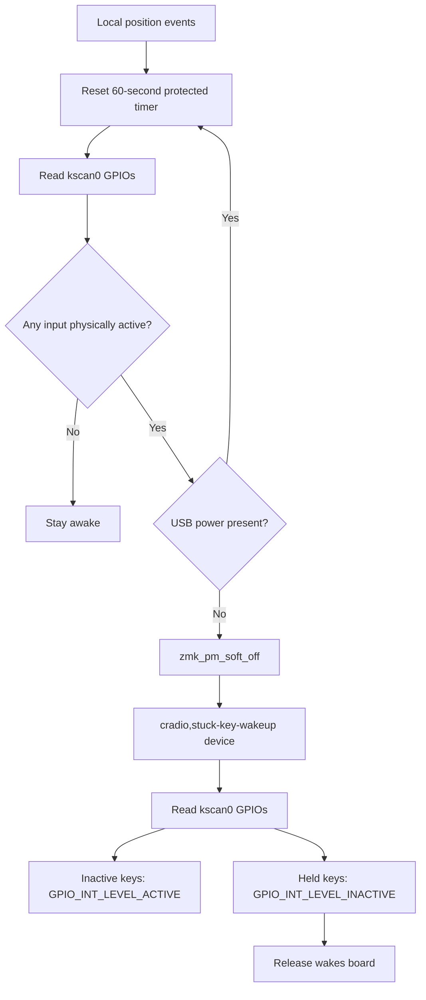

# Architecture Diff

## Summary

Updates the per-half stuck-key protected sleep path so a physically held key enters soft-off after 60 seconds without local key-state changes and wakes only when the held key is released.

## Diagram(s)

## Changes

### Added

- `cradio,stuck-key-wakeup`: soft-off wake device that reads `kscan0` GPIO state and arms inactive keys for press-to-wake and held keys for release-to-wake.
- `CONFIG_CRADIO_STUCK_KEY_SLEEP`: module option that enables the protected timer and wake device source.
- `Makefile`: local `make test` target that builds both Ferris halves.

### Modified

- `config/cradio.conf`: normal idle sleep remains 11 minutes, protected stuck-key sleep is 60 seconds, and ZMK soft-off support is enabled.
- `config/cradio.overlay`: registers the custom wake device under `zmk,soft-off-wakeup-sources`.
- `local-modules/cradio-led-indicator`: uses local key-state changes to reset the protected timer, samples `kscan0` GPIOs before soft-off, preserves the USB guard, and configures held keys to wake on release.
