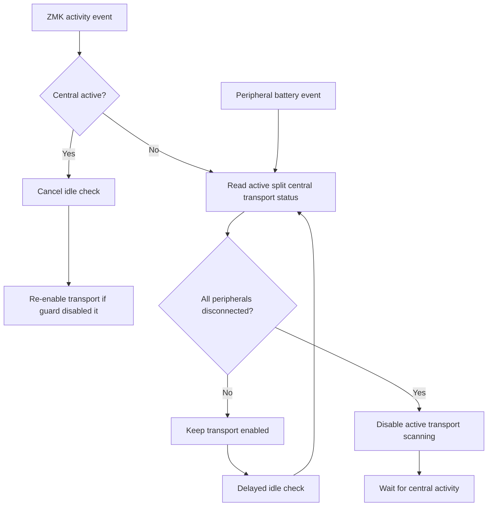

# Architecture Diff

## Summary
The left split central now disables the active split transport when the keyboard is idle and every split peripheral is disconnected, then re-enables that transport when the central becomes active.

## Diagrams

## Changes

### Added

- `local-modules/cradio-led-indicator/split_idle_scan_guard.c`: Listens for central activity and peripheral battery events, polls split transport status while idle, disables the active central transport only after all peripherals are disconnected, and restores that transport on central activity.
- `CRADIO_SPLIT_IDLE_SCAN_GUARD`: Central-only Kconfig switch compiled through `target_sources_ifdef`.

### Modified

- `config/cradio_left.conf`: Enables `CRADIO_SPLIT_IDLE_SCAN_GUARD` only on the left central half.
- `CHANGELOG.md`: Adds the PR-facing fixed entry.

### Removed

- None.
