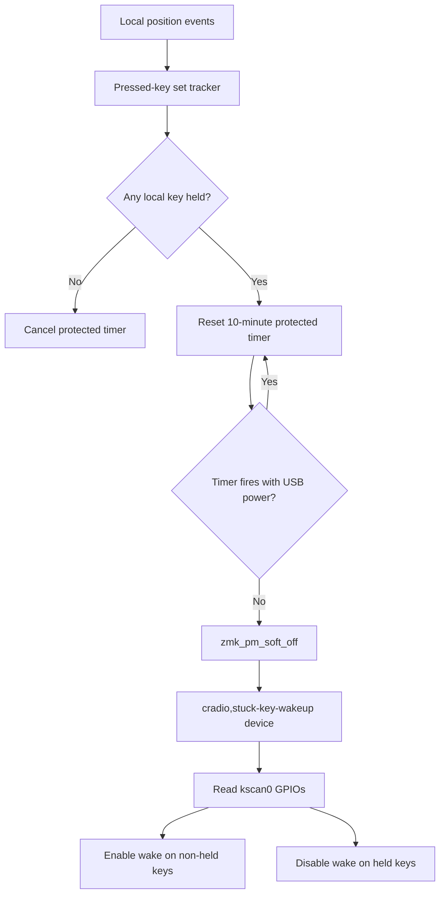

# Architecture Diff

## Summary

Adds a per-half stuck-key protected sleep path that soft-offs only after the local pressed-key set remains unchanged for 10 minutes.

## Diagram(s)

## Changes

### Added

- `cradio,stuck-key-wakeup`: soft-off wake device that reads `kscan0` GPIO state and only arms non-held keys.
- `CONFIG_CRADIO_STUCK_KEY_SLEEP`: module option that enables the protected timer and wake device source.
- `Makefile`: local `make test` target that builds both Ferris halves.

### Modified

- `config/cradio.conf`: normal idle sleep is 11 minutes, protected stuck-key sleep is 10 minutes, and ZMK soft-off support is enabled.
- `config/cradio.overlay`: registers the custom wake device under `zmk,soft-off-wakeup-sources`.
- `local-modules/cradio-led-indicator`: adds the pressed-key tracker, protected timer, USB guard, and devicetree binding.
