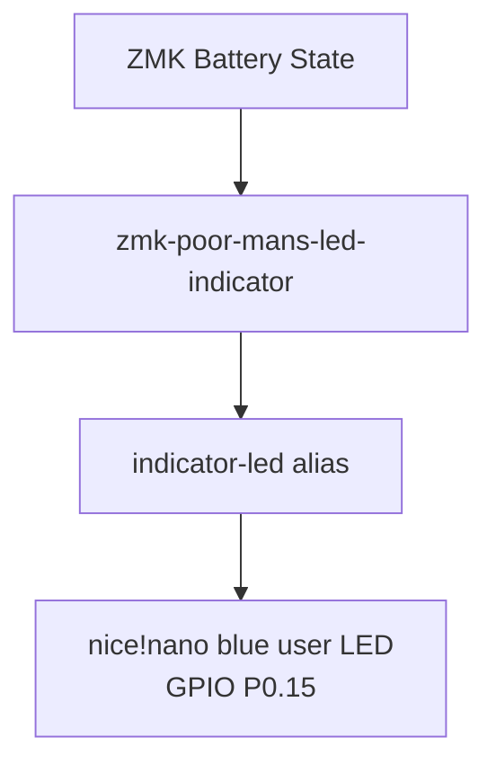

# Architecture Diff

## Summary

Adds the `zmk-poor-mans-led-indicator` module and maps the nice!nano v2 onboard blue LED on GPIO `P0.15` to the Cradio `indicator-led` alias so battery status can be shown without a display.

## Diagram(s)

## Changes

### Added
- `config/cradio.overlay`: Defines the onboard blue LED as a GPIO LED and exposes it as `indicator-led`.
- `README.md`: Documents the blue LED battery indication behavior.

### Modified
- `config/west.yml`: Adds the `bluedrink9` remote and `zmk-poor-mans-led-indicator` external module pinned to `main`.
- `config/cradio.conf`: Enables the indicator LED widget, shows battery on boot, disables BLE/layer indication, and sets the low/critical thresholds.
