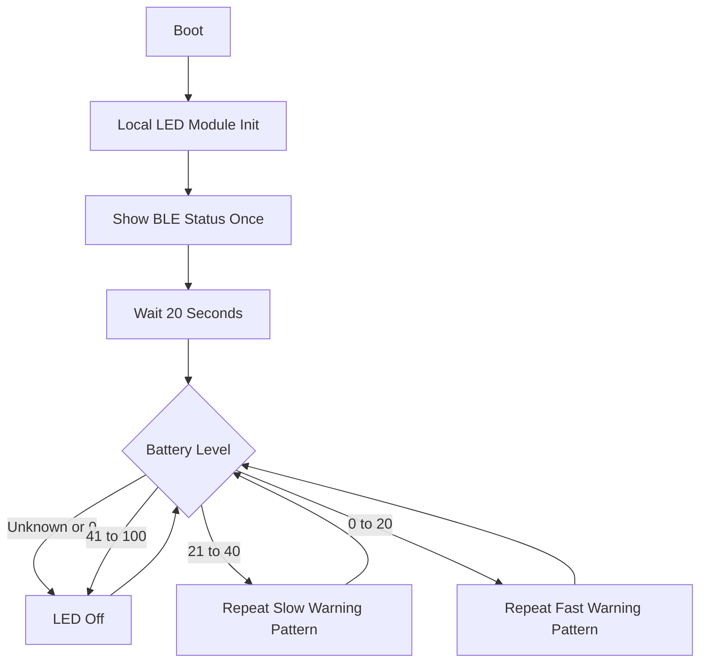

# Cradio Blue LED Indicator Design

## Summary

Move the LED indicator behavior fully into this repository by vendoring a local ZMK module and updating the build configuration to load it explicitly. On boot, the blue LED will show BLE status once. After 20 seconds, the LED will switch to battery-only tracking: no blinking above 40%, a slower repeating warning pattern from 21% to 40%, and a faster repeating warning pattern at 20% or below.

## Goals

- Ship the LED behavior entirely from this repository.
- Preserve a one-time BLE status indication during startup.
- Remove battery indication from startup.
- Start battery tracking 20 seconds after boot.
- Keep the LED dark during runtime when battery is above 40%.
- Document the LED behavior clearly in the repository README.

## Non-Goals

- No layer indication changes.
- No new BLE indication semantics beyond documenting the existing patterns.
- No dependency on a forked external indicator module.
- No attempt to make the LED show an exact battery percentage.

## Behavior

### Startup Behavior

- Boot shows BLE status once.
- Battery is not shown during startup.
- The startup BLE indication keeps the existing module behavior:
  - On the central side, the active profile number determines how many times the LED blinks.
  - Connected profiles use longer blinks.
  - Open or advertising profiles use short blinks.
  - Disconnected profiles use sparse blinks.
  - On the peripheral side, the LED indicates peripheral BLE connectivity using the existing connected and disconnected patterns when BLE indication is enabled there.

### Runtime Battery Behavior

- Runtime battery tracking starts 20 seconds after boot.
- If the battery level is unknown or reported as `0`, runtime tracking stays off and re-checks later.
- If battery is above 40%, the LED stays off.
- If battery is from 21% to 40%, the LED repeats a slower low-battery warning pattern with pauses.
- If battery is 20% or below, the LED repeats a faster critical-battery warning pattern with pauses.
- Runtime battery tracking is the only LED behavior after the 20-second startup window.

## Architecture

The implementation will vendor the indicator module into a tracked subdirectory in this repository. GitHub Actions will load that module through `build.yaml` `cmake-args` instead of relying on a remote module fetched via `west`.

## Implementation Plan

### Local Module Layout

- Add a tracked local module directory for the Cradio LED indicator implementation.
- Copy the existing indicator module as the starting point.
- Rename or scope the vendored module so it is clear this repository owns the behavior going forward.
- Keep the existing queue and thread model for blink scheduling.

### Module Behavior Changes

- Remove startup battery indication from the init path.
- Keep the existing one-time BLE startup indication.
- Add a delayed runtime battery loop that starts 20 seconds after boot.
- Add runtime-only battery thresholds so the 40% cutoff is independent from any boot-only thresholds.
- Keep runtime LED output battery-only after the startup window.

### Build Wiring

- Remove the external `zmk-poor-mans-led-indicator` project from `config/west.yml`.
- Update `build.yaml` to pass `-DZMK_EXTRA_MODULES=$GITHUB_WORKSPACE/local-modules/cradio-led-indicator` for each Cradio build target.
- Keep local manual build instructions based on passing `ZMK_EXTRA_MODULES` explicitly during verification.

### Configuration Changes

- Update `config/cradio.conf` to enable BLE startup indication.
- Disable startup battery indication.
- Configure runtime battery thresholds and any new Kconfig options introduced for the vendored module.
- Keep layer indication disabled.

### Documentation Changes

- Update `README.md` to describe:
  - boot-time BLE indication meanings
  - the 20-second delay before battery tracking starts
  - runtime battery blink meanings for `21%-40%` and `<= 20%`
  - the fact that battery above 40% stays dark during runtime

## Risks And Mitigations

- Risk: vendored module path is not loaded by GitHub Actions.
  - Mitigation: wire `ZMK_EXTRA_MODULES` through `build.yaml` for both Cradio targets and verify the build command output.
- Risk: local workspace contains untracked west checkouts that should not be committed.
  - Mitigation: stage only tracked repo files and avoid edits inside the untracked fetched module checkout.
- Risk: runtime battery loop could conflict with queued BLE startup blinks.
  - Mitigation: start runtime battery tracking only after the 20-second startup window.

## Verification

- Build at least one Cradio target locally with the vendored module path supplied through `ZMK_EXTRA_MODULES`.
- Confirm the generated `.config` contains the expected indicator settings.
- Confirm the build uses the local module path rather than the external module from `west.yml`.
- Run `git diff --check`.
